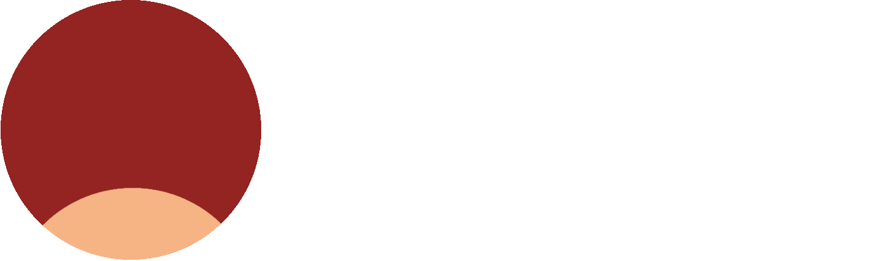

# ДАВО "Заря" - Децентрализованная автономная внутрипартийная организация

[](LICENSE)
[](https://github.com/Rassvet-CEC-ITD/zarya/issues)
[](https://github.com/Rassvet-CEC-ITD/zarya/stargazers)

> **Математически формализованное мнение партии через блокчейн-голосование**

Система для автоматизации управления мнением партии "Рассвет" с использованием технологий DAO и статистического анализа.

## 📋 Содержание

- [ДАВО "Заря" - Децентрализованная автономная внутрипартийная организация](#даво-заря---децентрализованная-автономная-внутрипартийная-организация)
  - [📋 Содержание](#-содержание)
  - [📖 Описание проекта](#-описание-проекта)
    - [🎯 Ключевые возможности](#-ключевые-возможности)
  - [🎯 Мотивация](#-мотивация)
    - [Проблемы современных партий:](#проблемы-современных-партий)
    - [Решение через "Зарю":](#решение-через-зарю)
  - [🧮 Математическая модель](#-математическая-модель)
    - [Эмпирическая реализация](#эмпирическая-реализация)
  - [⚡ Архитектура DAO](#-архитектура-dao)
    - [Поддерживаемые органы](#поддерживаемые-органы)
  - [📊 Примеры работы](#-примеры-работы)
  - [🔮 Прогнозирование](#-прогнозирование)
    - [Проверка нулевой гипотезы (H₀)](#проверка-нулевой-гипотезы-h)
  - [🛠️ Технологический стек](#️-технологический-стек)
  - [� Развёртывание](#-развёртывание)
    - [1. `Zarya.s.sol` — первоначальное развёртывание](#1-zaryassol--первоначальное-развёртывание)
    - [2. `ZaryaRegional.s.sol` — добавление региональных органов](#2-zaryaregionalssol--добавление-региональных-органов)
  - [�🔗 Полезные ссылки](#-полезные-ссылки)
  - [🤝 Участие в проекте](#-участие-в-проекте)

## 📖 Описание проекта

**ДАВО "Заря"** — распределённое ПО для формализации и анализа мнения партии "Рассвет" через математические методы и блокчейн-голосование.

### 🎯 Ключевые возможности

- 🧮 **Математическая формализация** мнения через матрицы случайных величин
- 🗳️ **DAO-голосование** с соответствием Уставу партии  
- 📊 **Статистический анализ** и агрегация мнений
- 📝 **Автогенерация** человекочитаемых документов
- 🔮 **Прогнозирование** изменений позиции партии

## 🎯 Мотивация

### Проблемы современных партий:

1. **Неэффективные консультации** - непредсказуемая длительность и качество обсуждений
2. **Бюрократическая нагрузка** - постоянные созывы органов для выяснения мнения
3. **Хаос документооборота** - бесконечные поправки и версии документов
4. **Фейковые новости и дезинформация** - сложно проверить достоверность заявлений и позиций без статистического анализа

### Решение через "Зарю":

- **Статистически обоснованные рекомендации** с заданной точностью
- **Фильтрация вопросов** и снижение бюрократической нагрузки  
- **Единая актуальная позиция** без версионности документов
- **Верификация через тестирование гипотез** - проверка соответствия заявлений реальному мнению партии

## 🧮 Математическая модель

Мнение партии формализуется как структура из двух типов данных:

```
PartyOpinion = {
    quantitative_matrix: X,    // числовые оценки
    categorical_matrix: Y      // категориальные суждения
}
```

где:
- `X` — матрица **непрерывных величин** (количественные оценки)
- `Y` — матрица **дискретных величин** (категориальные суждения)

### Эмпирическая реализация

В реальной системе используются накапливаемые выборки:

```
OpinionMatrix = {
    samples_X: накопленные_числовые_значения,
    samples_Y: накопленные_категориальные_значения
}
```

Агрегирование через функцию:
```
aggregated_opinion = aggregate_function(samples_X, samples_Y)
```

**Пример выборки:**
- Уровень безработицы: `[5.4, 5.6, 6.0, 4.9, 5.2]` → Среднее: `5.34%`
- Отношение к реформе: `["приемлемо", "желательно", "приемлемо"]` → Мода: `"приемлемо" (67%)`

## ⚡ Архитектура DAO

### Поддерживаемые органы

| Орган                                  | Код        | Представляет                  | Тип голосования                    |
| -------------------------------------- | ---------- | ----------------------------- | ---------------------------------- |
| Съезд партии                           | `СЗД`      | Делегаты от >50% субъектов РФ | Общепартийный                      |
| Председатель                           | `ПРЛ`      | Себя                          | Без голосования                    |
| Центральный совет                      | `СОВ`      | Члены Центрального совета     | Межсъездовый орган                 |
| Региональная конференция               | `НН.КОН`   | Делегаты от >50% МО в регионе | Высший орган региона               |
| Общее собрание регионального отделения | `НН.ОБС`   | Все члены РО                  | Высший орган региона               |
| Совет регионального отделения          | `НН.СОВ`   | Совет РО (если избран)        | Постоянно действующий региональный |
| Общее собрание местного отделения      | `НН.Х.ОБС` | Все члены МО                  | Основной орган на местах           |
| Совет местного отделения               | `НН.Х.СОВ` | Совет МО (если избран)        | Делегированное управление МО       |

## 📊 Примеры работы

<details>
<summary><b>🌱 Экологическая инициатива</b></summary>

**Ячейка:** `Y[15][3]` - "Экология — 74.2.СОВ"  
**Новое значение:** `"приемлемо"`  
**Результат голосования:** Утверждено МО №2 Челябинской области  

**Агрегированный результат:**
- "приемлемо": 72%
- "сомнительно": 18%  
- "неприемлемо": 10%

**Автосгенерированный текст:**
> "Совет МО №2 Челябинской области считает экологические последствия рекультивации свалок приемлемыми (поддержка — 72% участников)."

</details>

## 🔮 Прогнозирование

### Проверка нулевой гипотезы (H₀)

Система предсказывает изменение мнения **до** голосования:

```python
function predict_change(current_sample, new_value):
    new_sample = current_sample + [new_value]
    return will_opinion_change(new_sample)
```

**Пример:** Если добавить значение `20%` к выборке налоговой нагрузки `[13.5, 14.0, 14.2, 15.1]`:
- Новое среднее: `15.36%` 
- **H₀ нарушена** → мнение партии изменится

## 🛠️ Технологический стек

- **Solidity** + **Foundry** - смарт-контракты

## � Развёртывание

Развёртывание разбито на два скрипта.

### 1. `Zarya.s.sol` — первоначальное развёртывание

Разворачивает контракт и инициализирует единственный обязательный орган — Председателя.

**Переменные окружения:**

| Переменная | Описание                          |
| ---------- | --------------------------------- |
| `CHAIRMAN` | Адрес Председателя партии (`ПРЛ`) |

```bash
CHAIRMAN=0xADDRESS RPC_URL=https://rpc.url PRIVATE_KEY=0xKEY \
  forge script script/Zarya.s.sol \
  --rpc-url $RPC_URL --private-key $PRIVATE_KEY --broadcast
```

```powershell
$env:CHAIRMAN="0xADDRESS"; $env:RPC_URL="https://rpc.url"; $env:PRIVATE_KEY="0xKEY"
forge script script/Zarya.s.sol `
  --rpc-url $env:RPC_URL --private-key $env:PRIVATE_KEY --broadcast
```

```
== Logs ==
  Заря развёрнута по адресу: 0x75BbACe4A6720636622F1a344B13c5DC193D06a4
  Председатель (ПРЛ): 0x2aF5b7345A705Ea8910c209d7469656831aE5357
```

### 2. `ZaryaRegional.s.sol` — добавление региональных органов

Запускается после развёртывания. Создаёт голосование о вступлении первого члена Совета регионального отделения через механизм DAO.

**Переменные окружения:**

| Переменная                | Описание                                                   |
| ------------------------- | ---------------------------------------------------------- |
| `ZARYA_ADDRESS`           | Адрес задеплоенного контракта `Zarya`                      |
| `REGIONAL_SOVIET_MEMBERS` | Адреса кандидатов в 74.СОВ через запятую (`0x1...,0x2...`) |
| `VOTING_DURATION`         | Длительность голосования в секундах                        |

```bash
ZARYA_ADDRESS=0xADDRESS REGIONAL_SOVIET_MEMBERS=0xMEMBER1,0xMEMBER2 VOTING_DURATION=604800 \
  RPC_URL=https://rpc.url PRIVATE_KEY=0xKEY \
  forge script script/ZaryaRegional.s.sol \
  --rpc-url $RPC_URL --private-key $PRIVATE_KEY --broadcast
```

```powershell
$env:ZARYA_ADDRESS="0xADDRESS"; $env:REGIONAL_SOVIET_MEMBERS="0xMEMBER1,0xMEMBER2"; $env:VOTING_DURATION="604800"
$env:RPC_URL="https://rpc.url"; $env:PRIVATE_KEY="0xKEY"
forge script script/ZaryaRegional.s.sol `
  --rpc-url $env:RPC_URL --private-key $env:PRIVATE_KEY --broadcast
```

## �🔗 Полезные ссылки

- **[Презентация](https://docs.google.com/presentation/d/1mRsgTg3XsrVSvXpRoXnVyLOgX2QSJKPEfJUwnsZz_Uk/edit?usp=sharing)** - детальный обзор системы

## 🤝 Участие в проекте

1. 🍴 Fork репозитория
2. 🔨 Внесите изменения  
3. 📤 Создайте pull request

<div align="center">
<b>Сделано с ❤️ для партии "Рассвет"</b><br>
<sub>Версия: Челябинск | 2026</sub>
</div>